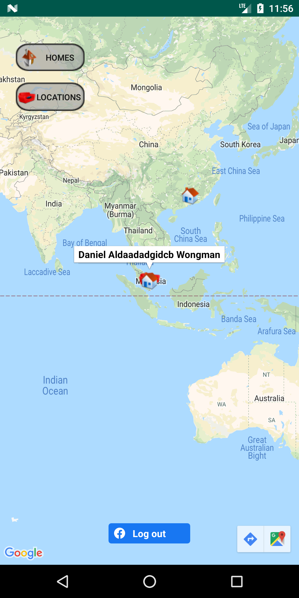
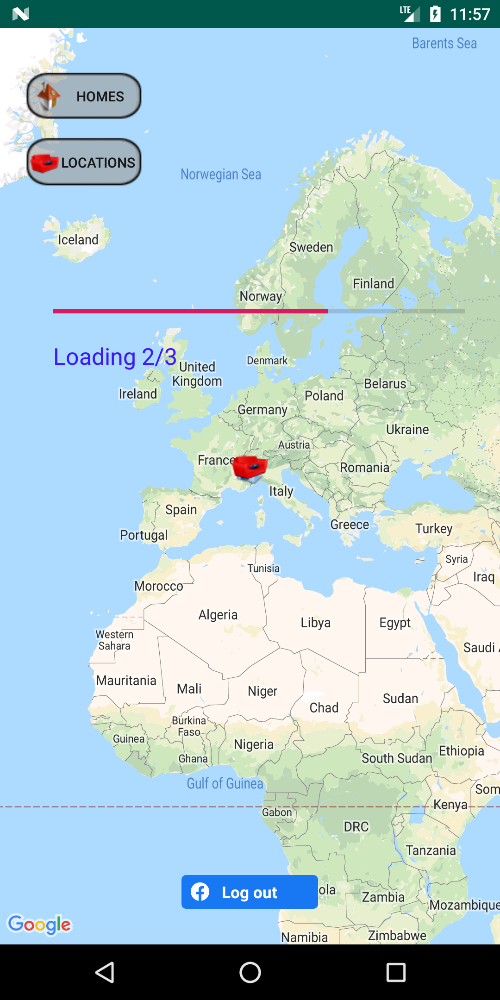

# BuddiesMap Project

This project was first created as final assignment in an android
course in 2011.

It was developed by **Stas Isackov and Rotem Hungem** ---> [Final presentation :)](./misc/2011%20course%20materials)

This iteration of the project is updated to run on Android 7.0 Nougat.
-  Google Maps SDK for Android 
-  Facebook SDK 5.5.1

## What the app does?
- The main activity is a map.
- Upon logging in to a Facebook account, the locations and hometowns of
  the user and their friends are shown on the map
  
   | 

### In progress
- Upon logging in to a Facebook account the user's photo would appear at
  the top of the screen
- Clicking on a marker shows a list of all the friends at the marker's
  location. Selecting a friend will open a dialog with an option to
  message him/her
- Menu with following options:
  - **Search** for a friend and if found center the map to his location
  - **Recommend** a service/utility
  - **Find a recommendation** from your friends based on location
